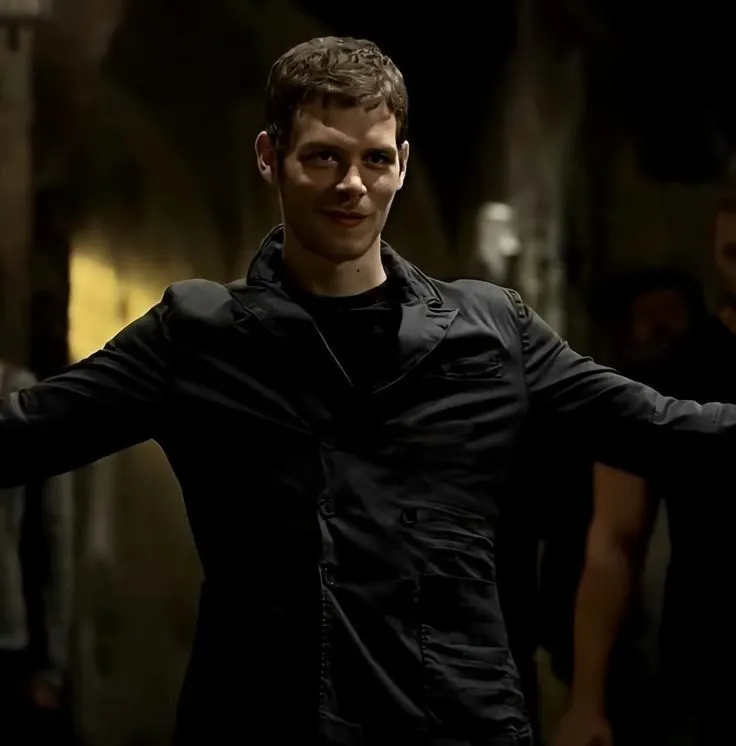
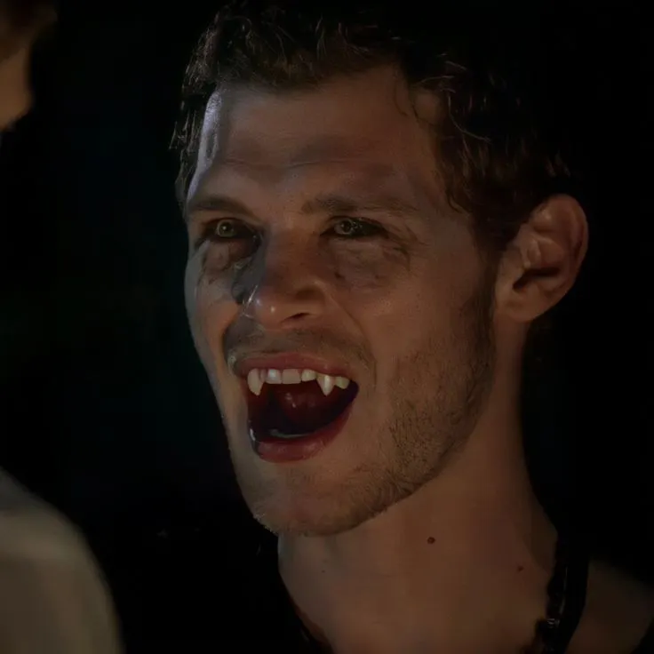

# vishwajeet
<!DOCTYPE html>
<html lang="en">
<head>
  <title>Assignment </title>
  
</head>
<body>
  
  

   Klaus Mikelson ~ THE HYBRID
    Klaus Mikaelson is known for his powerful lines that reveal his thoughts on family, love, and power, often highlighting his complex nature as both a ruthless villain and a devoted family man.
 He emphasizes the importance of family, stating, "Family are not just people who coddle you, who grant you your every whim. They are people who fight for you, who you fight for" 
 , and "You never learned that the bonds of family far outweigh anything else".
  

   

  
 

   
  

</body>
</html>
